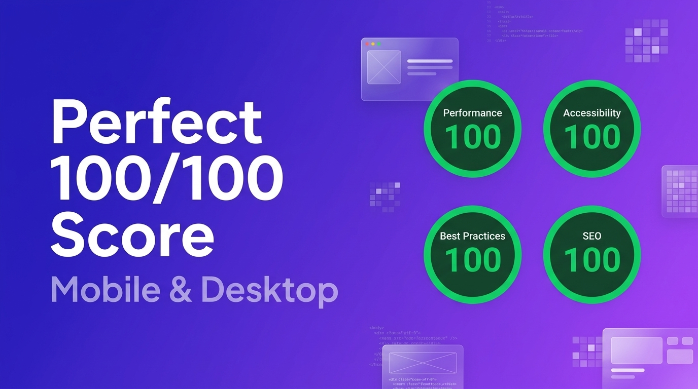

<div align="center">
  <h1>Astro SEO Theme</h1>

  

  <p><strong>The ultimate open-source SEO theme for Astro, designed for B2B SaaS and Enterprise.</strong></p>

[](https://choosealicense.com/licenses/mit/)
[](https://astro.build/)
[](https://tailwindcss.com/)
[](http://makeapullrequest.com)

  <br />
  <a href="https://vercel.com/new/clone?repository-url=https%3A%2F%2Fgithub.com%2Fdruedaro%2Fastro-seo-theme">
    
  </a>
  <br />
  <a href="https://astro-seo-theme.vercel.app">View Demo</a>
  ·
  <a href="https://github.com/druedaro/astro-seo-theme/issues">Report Bug</a>
  ·
  <a href="https://github.com/druedaro/astro-seo-theme/issues">Request Feature</a>
</div>

---

Astro SEO Theme is an open-source website template built with [Astro](https://astro.build/), [Tailwind CSS v4](https://tailwindcss.com/), and [React](https://react.dev/). You get a highly-optimized landing page, dynamic blog, case studies section, and enterprise-grade SEO tooling in one repo. It's designed so you can launch a premium web presence for a B2B SaaS or startup just by editing content, instead of wrestling with Core Web Vitals from scratch. Unlike generic themes, it ships with an incredibly strict SEO setup, multilingual i18n, security headers, and CI pipelines already wired up.

Live demo: [astro-seo-theme.vercel.app](https://astro-seo-theme.vercel.app/)

<div align="center">
  <br />
  
  <br />
  <sub><em>Validated perfectly for Mobile & Desktop Performance, Accessibility, Best Practices, and SEO.</em></sub>
</div>

<br />
- **Three content hubs in one.** High-converting landing page, markdown-driven blog, and case studies portfolio, all sharing a single responsive layout and megamenu.
- **Enterprise-grade SEO.** Centralized `hreflang` generation, JSON-LD structured data, auto-generated sitemaps, and `robots.txt`. Built-in support for GEO (Generative Engine Optimization).
- **100/100 Lighthouse Performance.** "Zero-JS by default" architecture using Astro Islands. Ships 0 KB of JavaScript to the client unless absolutely necessary (like the React-based dark mode toggle).
- **Multilingual out of the box.** Complete English and Spanish implementations included. File-based routing makes it trivial to add more languages.
- **Production-hardened.** Strict Content Security Policy (CSP) and security headers via `vercel.json`, GitHub Actions CI pipeline for type-checking and automated dependabot updates.
- **Modern stack.** Astro 5, Tailwind CSS 4, React 19, TypeScript.
- **AI-assistant friendly.** [`AI_GUIDE.md`](AI_GUIDE.md) tells Cursor, Copilot, and Claude where things live and which conventions to follow so you can prompt your way to a customized site.
- **MIT licensed.** 100% free to use for personal and commercial projects.

Pages are composed using semantic Astro components and native CSS grid/flexbox:

```astro
---
import BaseLayout from '@/layouts/BaseLayout.astro';
import HeroSection from '@/components/marketing/HeroSection.astro';
---

<BaseLayout title="Home" description="The best SaaS product ever.">
  <HeroSection />
  <!-- Other components... -->
</BaseLayout>
```

---

## Table of Contents

- [Quick Start](#quick-start)
- [Theme Configuration](#theme-configuration)
  - [Global Meta Settings](#global-meta-settings)
  - [Header & Megamenu](#header--megamenu)
  - [Building Landing Pages](#building-landing-pages)
  - [Managing Content Collections](#managing-content-collections)
  - [Localization (i18n)](#localization-i18n)
- [Deploying to Production](#deploying-to-production)
- [Directory Layout](#directory-layout)
- [Technical Highlights](#technical-highlights)
  - [Generative Engine Optimization (GEO)](#generative-engine-optimization-geo)
  - [Sitemap & Crawlability](#sitemap--crawlability)
  - [Enterprise Security](#enterprise-security)
- [Contributing](#contributing)
- [License](#license)

---

## Quick Start

You need **Node.js 18+** and **npm** (or pnpm/yarn).

**1. Create your repo.** You can use the Astro CLI to scaffold a new project directly from this template:

```bash
npm create astro@latest -- --template druedaro/astro-seo-theme my-saas-website
cd my-saas-website
```

**2. Install dependencies:**

```bash
npm install
```

**3. Start the dev server:**

```bash
npm run dev
```

Open [http://localhost:4321](http://localhost:4321). Edits to any file reload the page instantly.

**4. Build for production:**

```bash
npm run build
```

This builds the site into `dist/`. Preview the result with `npm run preview`.

> **Tip**
> Only need one language? Simply delete the `src/pages/es` folder and remove the language picker from the Header component.

---

## Theme Configuration

### Global Meta Settings

Everything site-wide lives in `src/layouts/BaseLayout.astro` and `src/i18n/ui.ts`. The default `siteName` is injected automatically into titles and metadata.

> [!IMPORTANT]
> Change the `site` property in `astro.config.mjs` before going to production. If you skip this, your auto-generated sitemap and `robots.txt` will point to the wrong domain, which will severely hurt your SEO.

### Header & Megamenu

Edit `src/components/layout/Header.astro` to modify the navigation. The theme includes a robust, CSS-only desktop megamenu and a mobile accordion menu built without heavy client-side JavaScript.


### Building Landing Pages

Pages in `src/pages/` compose sections from `src/components/marketing/` and `src/components/seo/`. Open `src/pages/index.astro` to see the full homepage, then edit the props or remove sections you don't need.

### Managing Content Collections

Content is Markdown/MDX in `src/content/blog/` and `src/content/case-studies/`. Schemas are defined in `src/content.config.ts`. A case study looks like this:

```mdx
---
title: 'How TechCorp Scaled with Us'
description: 'A deep dive into B2B growth.'
client: 'TechCorp'
date: 2026-09-15
---

Case study body here.
```

### Localization (i18n)

Marketing pages are file-based: `src/pages/` for English, `src/pages/es/` for Spanish. A `LanguagePicker` component in the Header switches between them. UI strings are centralized in `src/i18n/ui.ts`. `BaseLayout` automatically handles `hreflang` tag generation to prevent duplicate content penalties across languages.

---

## Deploying to Production

`npm run build` produces a static site in `dist/` that any static host can serve.

> [!TIP]
> The included `vercel.json` enforces strict security headers by default. If you plan to load external scripts (like Google Analytics) or images from other domains, you will need to adjust the `Content-Security-Policy` inside that file so they aren't blocked.

- **Vercel:** Import the project directly. The included `vercel.json` adds strict security headers and caching rules.
- **Netlify / Cloudflare Pages:** Works out of the box with zero configuration required.

---

## Directory Layout

```text
src/
├── assets/                 # Local images and fonts
├── components/
│   ├── layout/             # Header, Footer, megamenu
│   ├── marketing/          # Hero, BentoGrid, PricingTable, ContactForm
│   ├── seo/                # Breadcrumbs, JsonLd, FaqSchema
│   └── ui/                 # LanguagePicker, DarkModeToggle
├── content/
│   ├── authors/            # JSON files for author profiles (E-E-A-T)
│   ├── blog/               # MDX posts separated by language (en/ & es/)
│   └── case-studies/       # MDX case studies separated by language (en/ & es/)
├── i18n/                   # ui.ts (translations) & utils.ts
├── layouts/                # BaseLayout.astro & specific page layouts
├── pages/                  # File-based routes
│   ├── index.astro         # English Home
│   ├── blog/               # English blog routes
│   ├── case-studies/       # English case studies routes
│   ├── es/                 # Spanish localized routes
│   └── rss.xml.js          # RSS feed generator
├── content.config.ts       # Astro Content Collections schemas
└── styles/
    └── global.css          # Tailwind v4 theme and typography vars
```

---

## Technical Highlights

### Generative Engine Optimization (GEO)

`BaseLayout.astro` is the brain of the theme. It accepts `title`, `description`, `image`, and `articleDate` props. It automatically generates canonical URLs, Open Graph tags, Twitter cards, and `hreflang` alternate links.

For structured data, the theme uses `src/components/seo/JsonLd.astro` and `FaqSchema.astro` to inject `<script type="application/ld+json">` payloads, crucial for Generative Engine Optimization (GEO).

### Sitemap & Crawlability

The `@astrojs/sitemap` integration generates the sitemap automatically at build time. `robots.txt` is served statically from the `public/` directory.

### Enterprise Security

`vercel.json` sets `Content-Security-Policy`, `Strict-Transport-Security`, `X-Content-Type-Options`, and `X-Frame-Options` to ensure the site gets an A+ on security scanners like Mozilla Observatory.

### Formatting

Code formatting is enforced using [Prettier](https://prettier.io/). The project includes `prettier-plugin-astro` and `prettier-plugin-tailwindcss` to automatically format `.astro` files and logically sort all Tailwind CSS classes.

> [!NOTE]
> Run `npm run format` locally before committing to ensure all files are perfectly formatted. If you use VS Code, the workspace is already configured to format on save.

---

## Contributing

- **Bugs and ideas:** open an issue.
- **Pull requests:** welcome.

See `CODE_OF_CONDUCT.md` and `CONTRIBUTING.md`.

## License

MIT. See `LICENSE`.

<div align="center">
  Crafted by <a href="https://github.com/druedaro">druedaro</a>.
</div>
